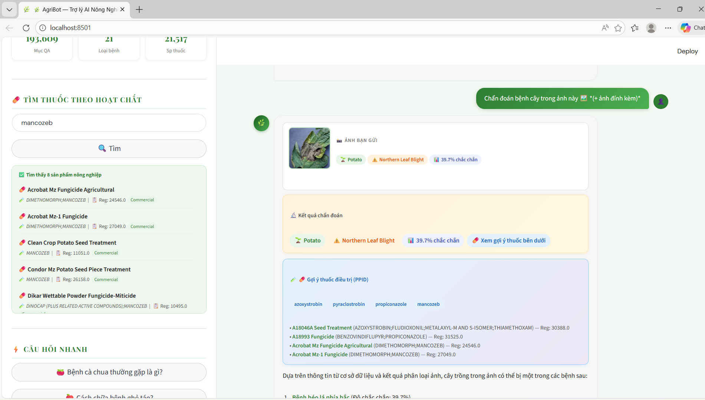
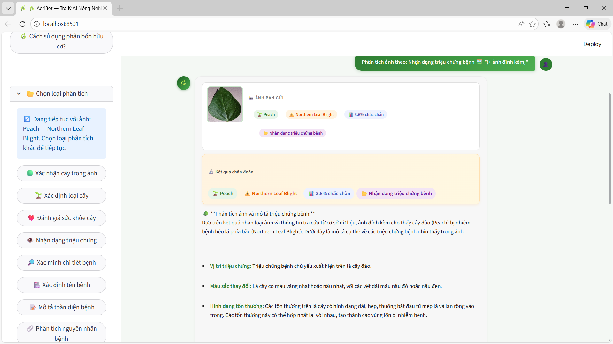

Hệ thống AI hỗ trợ chẩn đoán bệnh cây trồng và hỏi đáp kiến thức nông nghiệp.

link xem : https://doan2khanhnongnghiep221181-6nbkjuzajthr8o8uht3gmw.streamlit.app/

Các bước làm hệ thống : 

3 việc chính:

Nhận ảnh cây trồng → chẩn đoán bệnh và đưa thuốc điều trị

Nhận câu hỏi người dùng (text) → trả lời kiến thức nông nghiệp

Kết hợp ảnh + câu hỏi (VQA) → tư vấn cụ thể theo tình trạng cây

------------------------
Quy trình xây dựng chatbot + KEY AI Groq : 

BƯỚC 1: Chuẩn bị dữ liệu

Dataset: PlantVillageVQA

BƯỚC 2: Xử lý dữ liệu sang .pkl 

BƯỚC 3: Train / load model ảnh

Train model phân loại bệnh

Hoặc load model có sẵn

BƯỚC 4: Logic tư vấn

BƯỚC 5: Chatbot hội thoại

Nhận input:

text

ảnh

BƯỚC 6: Giao diện trợ lý

Streamlit / FastAPI / Web

---------------------------------------

  

  

